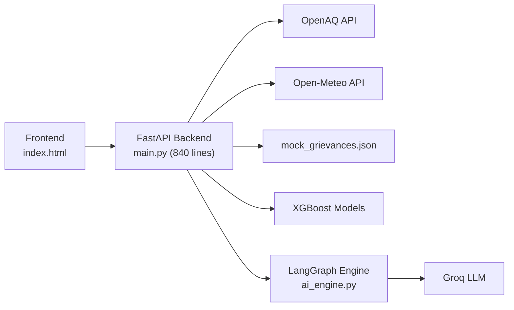
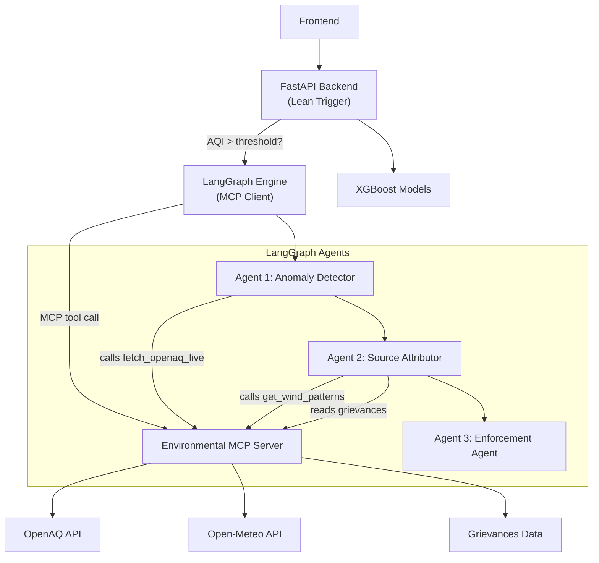

# MCP Integration into AeroGuard Architecture

Refactor the AeroGuard system to use the Model Context Protocol (MCP) for data retrieval, separating external API concerns from the AI agent logic and FastAPI trigger layer.

## Current Architecture (As-Is)



**Problem**: [main.py](file:///e:/et_hackathon/backend/main.py) is a monolith (840 lines) that directly handles API calls to OpenAQ, Open-Meteo, grievance data loading, XGBoost forecasting, AND orchestrates the LangGraph pipeline. All data is pre-fetched and passed as a massive `CityState` to the agents.

## Proposed Architecture (To-Be)



---

## Feasibility Analysis

### ✅ What Makes This Feasible

| Factor | Assessment |
|---|---|
| **Python MCP SDK maturity** | The `mcp` Python package (v1.x) is stable and supports both `stdio` and `SSE` transports. Fully compatible with your Python stack. |
| **LangChain MCP integration** | `langchain-mcp-adapters` provides `load_mcp_tools()` which converts MCP tools into LangChain-compatible tools usable by agents with `.bind_tools()`. |
| **Groq tool-calling support** | Groq's Llama 3.3 70B supports native function/tool calling, which is required for MCP tool use via LangGraph agents. |
| **Existing code is already modular** | The OpenAQ, weather, and grievance logic in [main.py](file:///e:/et_hackathon/backend/main.py) are already distinct functions — they can be extracted into MCP tools with minimal refactoring. |
| **No breaking changes to frontend** | The frontend only talks to FastAPI endpoints. The MCP server is internal — the frontend never sees it. |

### ⚠️ Risks & Considerations

| Risk | Mitigation |
|---|---|
| **MCP server process management** | Use `stdio` transport (in-process via subprocess) to avoid needing a separate long-running server. LangChain handles the lifecycle. |
| **OpenAQ rate limiting** | The MCP server should carry forward the existing `time.sleep(0.3)` and retry-on-429 logic. Add caching at the MCP tool level. |
| **Token cost of tool-calling** | Each MCP tool call adds ~50-100 tokens of function schema overhead. However, this is far less than the current approach of dumping entire JSON payloads into the prompt. **Net savings expected.** |
| **Cold start latency** | `stdio` MCP servers spin up in <500ms (Python process init). Negligible compared to Groq API latency (~200-500ms per call). |
| **Debugging complexity** | MCP adds an indirection layer. Mitigate by adding structured logging in the MCP server and keeping the `/debug` endpoint. |

---

## User Review Required

> [!IMPORTANT]
> **OpenAQ API Key**: The current `.env` file has `GROQ_API_KEY` but no `OPENAQ_API_KEY`. The MCP server will need access to the same environment variables. Should we use a shared `.env` or pass keys as server init args?

> [!IMPORTANT]
> **Open-Meteo vs OpenWeather**: Your current stack uses **Open-Meteo** (free, no key), but the plan mentions **OpenWeather API**. Should we stick with Open-Meteo (simpler, no key needed) or switch to OpenWeather (requires API key, more features)?

> [!WARNING]
> **Transport choice**: `stdio` transport (recommended) means the MCP server runs as a subprocess managed by the LangGraph client. This is simplest but means the server isn't independently deployable. If you want the MCP server to be a standalone network service (for future multi-client use), we'd use `SSE` transport instead — but that adds deployment complexity. Which do you prefer?

## Open Questions

1. **Should XGBoost forecasting also move behind MCP?** The plan doesn't mention it, and forecasting is tightly coupled to the FastAPI response format. Keeping it in FastAPI seems cleaner, but adding a `get_station_forecast(station: str)` MCP tool would let agents reason about future AQI trends. What's your preference?

2. **CPCB integration**: The plan mentions CPCB as an external source but there's no CPCB integration in the current codebase. Should we add a stub/placeholder MCP tool for CPCB, or skip it for now?

3. **Agent tool-calling model**: Currently all 3 agents use `ChatGroq(model="llama-3.3-70b-versatile")`. Only Agents 1 and 2 need MCP tool access. Agent 3 (Enforcement) just generates a dispatch order from the previous state. Should we keep this asymmetry, or give all agents tool access?

---

## Proposed Changes

### Component 1: Environmental MCP Server

#### [NEW] [mcp_server.py](file:///e:/et_hackathon/backend/mcp_server.py)

A standalone MCP server exposing environmental data as tools and resources.

**Tools to implement:**
```python
@mcp.tool()
async def fetch_openaq_live(city: str, parameter: str = "pm25") -> dict:
    """Query the OpenAQ API for live air quality data for a given city.
    Returns station-level pollutant readings."""

@mcp.tool()
async def get_wind_patterns(latitude: float, longitude: float) -> dict:
    """Query Open-Meteo for current wind speed, direction, temp, humidity.
    Returns atmospheric data relevant to pollution dispersion analysis."""
```

**Resources to implement:**
```python
@mcp.resource("municipal_grievances://{ward_id}")
async def get_grievances(ward_id: str) -> str:
    """Read citizen grievances for a specific ward/district.
    Returns filtered grievances from mock_grievances.json."""
```

**Key details:**
- Extracts and encapsulates functions currently in [main.py](file:///e:/et_hackathon/backend/main.py) lines 120-161 (`get_delhi_pm25_locations`), 177-216 (`fetch_current_weather`, `get_current_weather_cached`), and 108-109 (grievances loading).
- Adds its own caching layer for weather and OpenAQ data.
- Handles rate-limiting retries for OpenAQ internally.
- Loads API keys from the shared `.env` file.

---

### Component 2: Upgraded LangGraph Engine (MCP Client)

#### [MODIFY] [ai_engine.py](file:///e:/et_hackathon/backend/ai_engine.py)

Transform the current prompt-only agents into tool-calling agents that use MCP.

**Changes:**
- **New `CityState` schema** — slim down from 9 fields to trigger context only:
  ```python
  class CityState(TypedDict):
      target_location: str          # e.g., "East, Delhi"
      alert_context: str            # e.g., "AQI Spike Detected"
      timestamp: str
      # --- populated by agents via MCP ---
      sensor_data: list[dict]
      wind_direction: str
      wind_speed_kmh: float
      regional_grievances: list[dict]
      is_hazardous: bool
      anomaly_summary: str
      identified_source: str
      enforcement_order: dict
  ```
- **Agent 1 (Anomaly Detector)**: Instead of receiving pre-filled sensor data, it will call `fetch_openaq_live` via MCP to get live pollutant readings, then analyze them.
- **Agent 2 (Source Attributor)**: Will call `get_wind_patterns` and read `municipal_grievances://{district}` via MCP to correlate wind direction with grievance data.
- **Agent 3 (Enforcement)**: Remains unchanged — it doesn't need MCP tools, it acts on state from Agents 1 & 2.
- **MCP client setup**: Use `langchain-mcp-adapters` to connect to the MCP server via `stdio` transport and load tools.

---

### Component 3: Streamlined FastAPI Backend

#### [MODIFY] [main.py](file:///e:/et_hackathon/backend/main.py)

Reduce the monolith by removing data-fetching logic that moves to the MCP server.

**Changes:**
- **Remove**: Direct OpenAQ API calls from the `/analyze-city` endpoint (lines 602-661). The LangGraph agents now fetch this data themselves via MCP.
- **Remove**: Weather fetching for AI analysis purposes from `/analyze-city`. Keep weather caching for the standalone `/weather` endpoint and XGBoost.
- **Remove**: Grievance loading/filtering for AI context (lines 676-682). The MCP server owns this now.
- **Simplify `/analyze-city`**: The endpoint becomes a trigger that:
  1. Does a lightweight AQI check (from cache or a quick OpenAQ poll)
  2. If AQI > threshold, invokes LangGraph with minimal trigger context
  3. Returns the LangGraph result + XGBoost forecasts
- **Keep**: XGBoost forecasting, `/ward-forecast`, `/weather`, `/district-boundaries`, `/grievances`, `/debug` endpoints — these serve the dashboard directly and don't need MCP.

---

### Component 4: Dependencies & Configuration

#### [MODIFY] [requirements.txt](file:///e:/et_hackathon/backend/requirements.txt)

Add:
```
mcp>=1.0.0
langchain-mcp-adapters>=0.1.0
```

#### [MODIFY] [.env](file:///e:/et_hackathon/.env)

No new keys needed if we stay with Open-Meteo. If switching to OpenWeather, add `OPENWEATHER_API_KEY`.

---

## Verification Plan

### Automated Tests

```bash
# 1. Test MCP server tools in isolation
python -m pytest backend/tests/test_mcp_server.py -v

# 2. Test upgraded LangGraph engine with mock MCP
python backend/ai_engine.py  # existing test harness

# 3. Run the full FastAPI app and hit /analyze-city
uvicorn backend.main:app --reload
# Then: curl http://localhost:8000/analyze-city?district=East
```

### Manual Verification

- **Verify MCP tools return correct data**: Run the MCP server standalone and call each tool with test inputs.
- **Verify agent tool-calling**: Check Groq model correctly decides which MCP tool to call based on its role.
- **Verify `/analyze-city` end-to-end**: Confirm the response includes AI analysis populated via MCP (not pre-filled).
- **Verify no regression**: Confirm `/ward-forecast`, `/weather`, `/debug` endpoints still work identically.
- **Token usage comparison**: Compare Groq token usage before/after MCP integration to validate context window savings.
